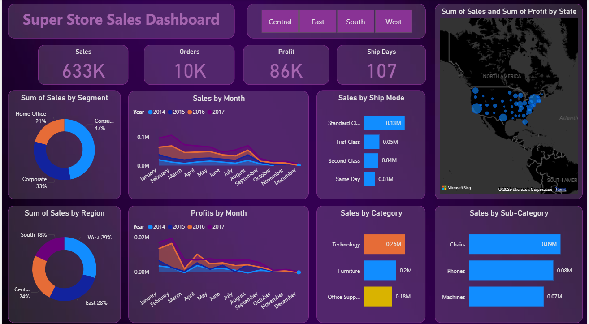

# Superstore-PowerBI-dashboard
Interactive sales dashboard built using Power BI on Superstore dataset

# 🧠 Superstore Sales Dashboard (Power BI)

## 📊 Overview

This Power BI dashboard provides an interactive overview of sales performance from the **Superstore** dataset, helping decision-makers understand key business metrics like:

- Sales trends over time  
- Profit performance  
- Regional and segment-wise contributions  
- Category-wise breakdown  
- Ship mode effectiveness  

---

## 📁 Dataset

- Dataset: [Sample - Superstore](https://www.kaggle.com/datasets/vivek468/superstore-dataset-final)
- Rows: ~10,000+
- Columns: 21
- Features: Sales, Profit, Quantity, Discount, Ship Mode, Region, Segment, Category, etc.

---

## 📌 Key Insights

- 💰 **Total Sales:** 633K  
- 📦 **Total Orders:** 10K  
- 📈 **Total Profit:** 86K  
- 🚚 **Avg Shipping Days:** 107 days

---

## 📊 Visualizations

- 🔁 **Sales by Month (Multi-year Line Chart)**
- 🎯 **Sales & Profit by Region, Category, Segment**
- 🚛 **Sales by Ship Mode**
- 🌍 **Geo Map by State**
- 📉 **Top 3 Sub-categories by Sales**

---

## 📁 Files in Repo

| File                     | Description                           |
|--------------------------|---------------------------------------|
| `Superstore_Dashboard.pbix` | Power BI Dashboard File             |
| `dashboard.png`           | Screenshot of Final Dashboard        |
| `README.md`              | Documentation and Overview            |

---

## ✍️ Created By

- **Name:** Manya Signhal  
- **Project:** Elevate Labs Data Analytics - Task 2  
- **Tool:** Power BI Desktop  
- **Dataset Source:** Kaggle

---

